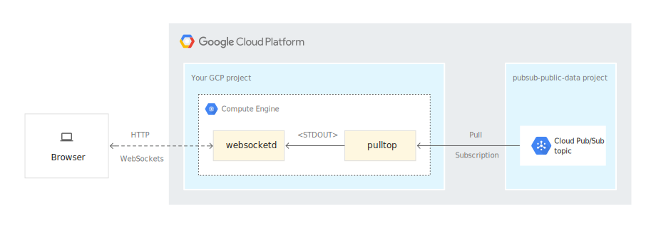

# `gke-pubsub-websocket-adapter`

The `gke-pubsub-websocket-adapter` provides an easy way to distribute [Google Cloud Pub/Sub](https://cloud.google.com/pubsub) topic messages over
[WebSockets](https://en.wikipedia.org/wiki/WebSocket) so that they may be sent to web clients without using the `gcloud` SDK or Pub/Sub API.

## Synopsis

The `gke-pubsub-websocket-adapter` is a tool to create the support infrastructure necessary to operate a
load-balanced, autoscaled [GKE](https://cloud.google.com/kubernetes-engine) cluster that mirrors
messages sent to a Pub/Sub topic to clients connecting through WebSockets.

## Requirements

To deploy `gke-pubsub-websocket-adapter` to your GCP project, you will need billing enabled
and the following permissions:

* Read access to the topic you'd like to mirror. The topic may reside
  in a separate project provided that it is readable by the user or service account
  `gke-pubsub-websocket-adapter` runs as.
* Pub/Sub subscripton creation privileges in your own project
* A GKE cluster
* A front-end load balancer 

Out-of-the-box, `gke-pubsub-websocket-adapter` defaults to using the [NYC Taxi RIdes public
topic](https://github.com/googlecodelabs/cloud-dataflow-nyc-taxi-tycoon) that is available to all GCP users. Please note that this
topic's message rate can go escalate to 2500 messages per second or
more at times.

## Architecture
The `gke-pubsub-websocket-adapter` clusters are stateless and doesn't require persistent disks for
the VMs in the cluster. A memory-mapped filesystem is specified within
the image that is used for ephemeral POSIX-storage of the Pub/Sub
topic messages. Storing a buffer of these messages locally has a few
advantages:

* It decouples the subscription from client WebSocket connections, and
  multiplexes potentially many clients while only consuming a single
  subscription per VM.
* By using `tail -f` as the command piped to [`websocketd`](http://websocketd.com/), clients are
  served a cache of the last 10 messages published to the topic,
  even when there is no immediate message flow. This allows for UIs
  rendering message content to show meaningful data even during periods
  of low traffic.

The `gke-pubsub-websocket-adapter` exposed to web clients through a single endpoint that maps to
an indivdual Pub/Sub topic and load balances across VMs in the cluster. The cluster is set to scale up and down
automatically based upon the number of clients connected.

Currently, the `gke-pubsub-websocket-adapter` uses WebSockets in half-duplex and does not support
the publishing of messages by clients over the same WebSocket connection.

## 

The `gke-pubsub-websocket-adapter`'s architecture consists of a number of underlying
components that work in concert to distribute Pub/Sub messages over
WebSockets. These include:

### Runtime

* [`websocketd`](http://websocketd.com/) CLI for serving websocket clients
* [`pulltop`](https://github.com/GoogleCloudPlatform/pulltop) CLI for Pub/Sub subscription management
* [GKE](https://cloud.google.com/kubernetes-engine)

### Deployment

* [Cloud Build](https://github.com/GoogleCloudPlatform/gke-pubsub-websocket-adapter/blob/main/cloudbuild.yaml)
* [Terraform](https://github.com/GoogleCloudPlatform/gke-pubsub-websocket-adapter/blob/main/setup/main.tf)

To deploy the `gke-pubsub-websocket-adapter` ensure you have set
`gcloud config set project sample-project` to the project you wish to
deploy the `gke-pubsub-websocket-adapter` in. After that you can run `sh deploy.sh` to deploy everything you need for a sample deployment using the public [NYC Taxi Rides feed](https://github.com/GoogleCloudPlatform/nyc-taxirides-stream-feeder) `projects/pubsub-public-data/topics/taxirides-realtime"` Pub/Sub topic. 

### Authentication

The `gke-pubsub-websocket-adapter` uses [Workload Identity](https://cloud.google.com/kubernetes-engine/docs/how-to/workload-identity) to authenticate with Pub/Sub under the Google service account called `dyson-sa`. If you are wanting to use a private Pub/Sub topic this service account will require access to the topic. 

## Configuration

[kpt](https://googlecontainertools.github.io/kpt/)  is used for setting config for the Kubernetes manifests.

You can see the variables that can be set by running `kpt cfg list-setters .` from within the directory.

For the default deploy, these variables are set for you in the `cloudbuild.yaml` file. If you would like to pass through a different topic for the example you can so by passing [substitution variables](https://cloud.google.com/cloud-build/docs/configuring-builds/substitute-variable-values) into Cloudbuild. 

 `gcloud builds submit --config cloudbuild.yaml --substitutions=_DYSON_APP_NAME="demo-app",_DYSON_TOPIC="projects/sample/topic"`

## Known issues and enhancements

* If you visit the cluster on the HTTP port instead of the WS/S port,
  you will be presented with the `websocketd` diagnostic
  page. Clicking on the checkbox will allow you to see the Pub/Sub
  messages coming through the WebSocket in the browser. This can be disabled by removing the `--devconsole` argument from the `websocketd` call in the [container setup's](https://github.com/GoogleCloudPlatform/gke-pubsub-websocket-adapter/blob/main/container/exec.sh) `exec.sh` file.
  
* If you would like to secure your websockets with TLS to support _wss_ (_WebSocket_ Secure) you can follow [this documentation](https://cloud.google.com/kubernetes-engine/docs/how-to/managed-certs) or if you would like to leverage Google-managed certificates you can use the following [documentation](https://cloud.google.com/kubernetes-engine/docs/how-to/managed-certs).

## See also

## Disclaimers

_This is not an officially supported Google product._

The `gke-pubsub-websocket-adapter` is under active development. Interfaces and functionality may change at any time.

## License

This repository  is licensed under the Apache 2 license (see [LICENSE](LICENSE.txt)).

Contributions are welcome. See [CONTRIBUTING](CONTRIBUTING.md) for more information.
